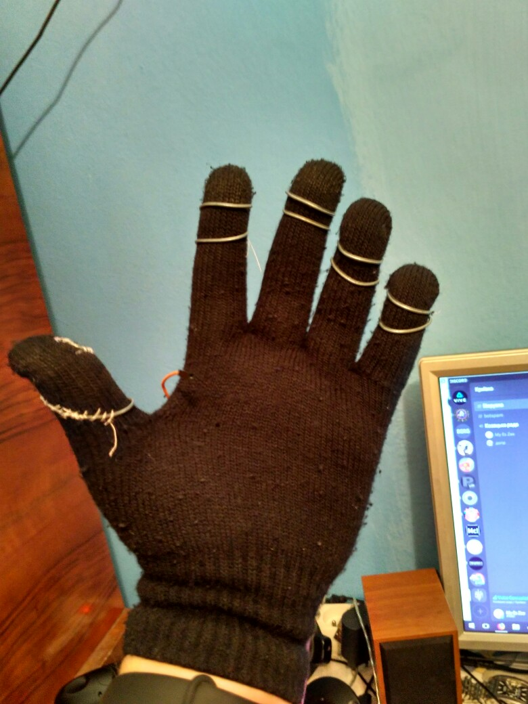

# SteamVR-Glove

Minimal Steam VR glove - uses Vive Controller for positioning.

Uses Arduino Nano for to check if fingers are touching palm (planned) or thumb - you can use all 8 buttons (Grip, Trigger, Menu, Touchpad Up Down Left Right Center)

Special crafted for DCS World and Virtual Button Box, for use with SteamVR Wheel - joystick mode.

Uses OpenVR-Input-Emulator to emulate trigger, grip and touchpad presses of the Vive Controller which would be strapped to your left hand. Should work in any SteamVR game.

